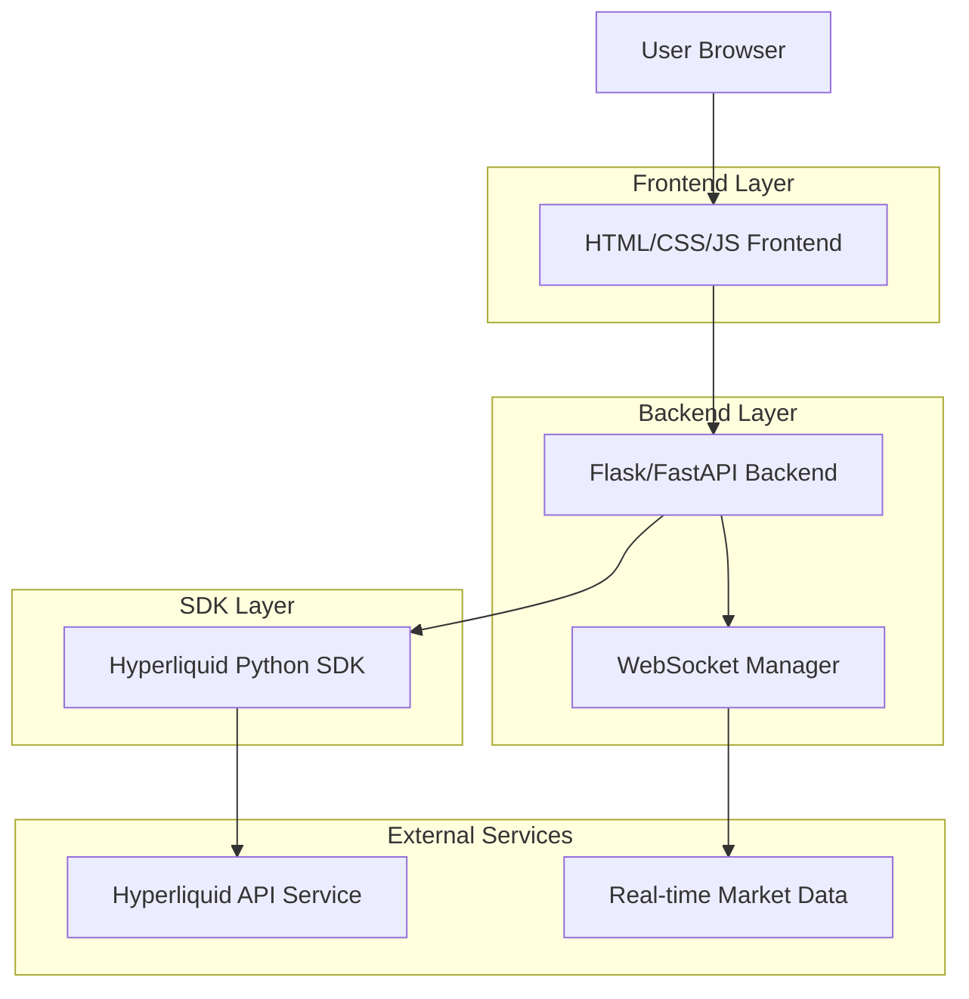
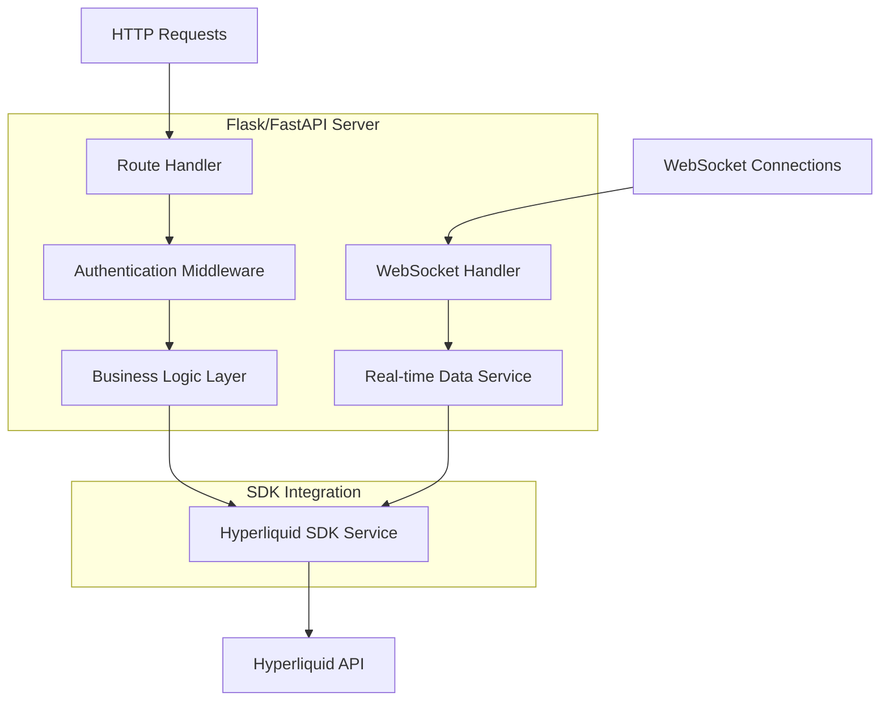

# Hyperliquid Trading Frontend - Technical Architecture Document

## 1. Architecture Design



## 2. Technology Description

- Frontend: HTML5 + CSS3 + Vanilla JavaScript + Chart.js/TradingView
- Backend: Flask/FastAPI + Hyperliquid Python SDK
- WebSocket: Native WebSocket API for real-time data
- Authentication: API Key based authentication

## 3. Route Definitions

| Route | Purpose |
|-------|---------|
| / | Dashboard page with account overview and portfolio summary |
| /trading | Trading interface for order placement and management |
| /portfolio | Portfolio management and position tracking |
| /market | Market data visualization and charts |
| /settings | API configuration and user preferences |
| /api/auth | API key validation and authentication |
| /api/orders | Order placement, modification, and cancellation |
| /api/positions | Portfolio and position data retrieval |
| /api/market | Market data and price information |
| /ws/data | WebSocket endpoint for real-time updates |

## 4. API Definitions

### 4.1 Core API

**Authentication**
```
POST /api/auth/validate
```

Request:
| Param Name | Param Type | isRequired | Description |
|------------|------------|------------|-------------|
| api_key | string | true | Hyperliquid API private key |
| account_address | string | true | Public key/account address |

Response:
| Param Name | Param Type | Description |
|------------|------------|-------------|
| status | boolean | Authentication status |
| message | string | Status message |

**Order Management**
```
POST /api/orders/place
```

Request:
| Param Name | Param Type | isRequired | Description |
|------------|------------|------------|-------------|
| asset | string | true | Trading asset symbol |
| is_buy | boolean | true | Order direction (buy/sell) |
| sz | number | true | Order size |
| limit_px | number | false | Limit price (for limit orders) |
| order_type | string | true | Order type (market/limit) |

Response:
| Param Name | Param Type | Description |
|------------|------------|-------------|
| status | string | Order status |
| order_id | string | Unique order identifier |

**Portfolio Data**
```
GET /api/portfolio/positions
```

Response:
| Param Name | Param Type | Description |
|------------|------------|-------------|
| positions | array | List of current positions |
| total_value | number | Total portfolio value |
| unrealized_pnl | number | Unrealized profit/loss |

**Market Data**
```
GET /api/market/data/{asset}
```

Response:
| Param Name | Param Type | Description |
|------------|------------|-------------|
| price | number | Current asset price |
| volume_24h | number | 24-hour trading volume |
| price_change_24h | number | 24-hour price change |
| order_book | object | Current bid/ask levels |

## 5. Server Architecture Diagram



## 6. Data Model

### 6.1 Data Model Definition

```mermaid
erDiagram
    USER ||--o{ API_CONFIG : has
    USER ||--o{ ORDER : places
    USER ||--o{ POSITION : holds
    ORDER ||--|| ASSET : references
    POSITION ||--|| ASSET : references

    USER {
        string user_id PK
        string account_address
        timestamp last_login
        object preferences
    }
    
    API_CONFIG {
        string user_id PK
        string encrypted_api_key
        string account_address
        boolean is_active
        timestamp created_at
    }
    
    ORDER {
        string order_id PK
        string user_id FK
        string asset
        string order_type
        number size
        number price
        string status
        timestamp created_at
    }
    
    POSITION {
        string position_id PK
        string user_id FK
        string asset
        number size
        number entry_price
        number unrealized_pnl
        timestamp updated_at
    }
    
    ASSET {
        string symbol PK
        string name
        number current_price
        number volume_24h
        timestamp last_updated
    }
```



### 6.2 Data Definition Language

**Session Storage (Browser)**
```javascript
// API Configuration (encrypted in browser storage)
const apiConfig = {
    accountAddress: 'string',
    encryptedApiKey: 'string', // Client-side encrypted
    isConnected: boolean,
    lastConnection: timestamp
};

// User Preferences
const userPreferences = {
    theme: 'dark' | 'light',
    defaultOrderSize: number,
    riskParameters: {
        maxOrderSize: number,
        stopLossEnabled: boolean
    },
    chartSettings: {
        interval: string,
        indicators: array
    }
};
```

**Backend Data Structures**
```python
# Order Request Model
class OrderRequest:
    asset: str
    is_buy: bool
    sz: float
    limit_px: Optional[float]
    order_type: str  # 'market' | 'limit'
    reduce_only: bool = False

# Position Response Model
class Position:
    asset: str
    size: float
    entry_price: float
    mark_price: float
    unrealized_pnl: float
    margin_used: float

# Market Data Model
class MarketData:
    asset: str
    price: float
    volume_24h: float
    price_change_24h: float
    bid: float
    ask: float
    timestamp: datetime
```