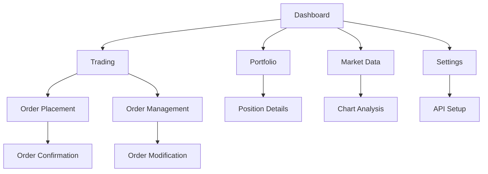

# Hyperliquid Trading Frontend - Product Requirements Document

## 1. Product Overview

A simple HTML-based web frontend that provides an intuitive interface for interacting with the Hyperliquid Python SDK, enabling users to perform trading operations, view account information, and monitor market data through a browser-based application.

The product solves the need for a user-friendly graphical interface to access Hyperliquid's trading capabilities, targeting traders and developers who prefer web-based tools over command-line interfaces. This frontend will democratize access to Hyperliquid's advanced trading features through an accessible web interface.

## 2. Core Features

### 2.1 User Roles

| Role | Registration Method | Core Permissions |
|------|---------------------|------------------|
| Trader | API Key Configuration | Can place orders, view positions, access market data |
| Viewer | Read-only API Access | Can view market data and account information only |

### 2.2 Feature Module

Our Hyperliquid trading frontend consists of the following main pages:
1. **Dashboard**: Account overview, portfolio summary, recent activity feed
2. **Trading**: Order placement interface, order book display, trade execution
3. **Portfolio**: Position management, balance overview, transaction history
4. **Market Data**: Price charts, market statistics, asset information
5. **Settings**: API configuration, trading preferences, account settings

### 2.3 Page Details

| Page Name | Module Name | Feature description |
|-----------|-------------|---------------------|
| Dashboard | Account Overview | Display total portfolio value, PnL, and key metrics |
| Dashboard | Recent Activity | Show latest trades, orders, and account activities |
| Dashboard | Quick Actions | Provide shortcuts for common trading operations |
| Trading | Order Placement | Create market/limit orders with size and price inputs |
| Trading | Order Book | Display real-time bid/ask levels and market depth |
| Trading | Active Orders | Manage open orders with cancel/modify functionality |
| Trading | Trade History | View completed trades with timestamps and details |
| Portfolio | Position Summary | Show current positions with PnL and margin info |
| Portfolio | Balance Overview | Display available balance and margin requirements |
| Portfolio | Transaction Log | List all account transactions and transfers |
| Market Data | Price Charts | Interactive candlestick charts with technical indicators |
| Market Data | Market Stats | Show 24h volume, price changes, and market metrics |
| Market Data | Asset Info | Display asset details and trading specifications |
| Settings | API Configuration | Secure input for API keys and connection settings |
| Settings | Trading Preferences | Set default order sizes, risk parameters |
| Settings | Theme Settings | Toggle between light/dark modes and layout options |

## 3. Core Process

**Main Trading Flow:**
Users configure their API credentials in Settings, then navigate to Dashboard to view account overview. From Trading page, they can place orders by selecting asset, order type, and parameters. Orders are submitted to Hyperliquid via the Python SDK backend. Users monitor positions in Portfolio and track market movements in Market Data section.

**Order Management Flow:**
Users create orders through the Trading interface, which validates inputs and sends requests to the backend API. Active orders appear in the order management panel where users can modify or cancel them. Executed trades update the portfolio automatically and appear in trade history.

## 4. User Interface Design

### 4.1 Design Style

- **Primary Colors**: Dark blue (#1a1a2e) and electric blue (#16213e) for professional trading aesthetic
- **Secondary Colors**: Green (#00ff88) for profits, red (#ff4757) for losses, yellow (#ffa502) for warnings
- **Button Style**: Rounded corners with subtle shadows and hover effects
- **Font**: Roboto for headers (16-24px), Source Code Pro for numbers (12-14px)
- **Layout Style**: Card-based design with clean grid layouts and responsive navigation
- **Icons**: Feather icons for consistency, trading-specific symbols for actions

### 4.2 Page Design Overview

| Page Name | Module Name | UI Elements |
|-----------|-------------|-------------|
| Dashboard | Account Overview | Large metric cards with color-coded PnL, progress bars for margin usage |
| Dashboard | Recent Activity | Timeline-style list with icons, timestamps, and status indicators |
| Trading | Order Placement | Form with dropdowns, number inputs, and prominent submit buttons |
| Trading | Order Book | Two-column table with green/red price levels and quantity bars |
| Portfolio | Position Summary | Data table with sortable columns and expandable row details |
| Market Data | Price Charts | Full-width TradingView-style chart with toolbar and indicators |
| Settings | API Configuration | Secure input fields with validation feedback and connection status |

### 4.3 Responsiveness

Desktop-first design optimized for trading workflows, with mobile-adaptive layouts for monitoring on smaller screens. Touch-friendly buttons and gestures for mobile users, with simplified navigation and condensed information display on tablets and phones.